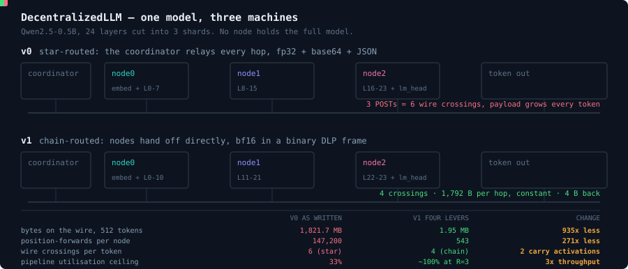

# DecentralizedLLM — pitch workspace

Submission materials for **DecentralizedLLM**: one LLM split across three machines, where no machine holds
the whole model. The working proof-of-concept lives in [`../DecentralizedLLM/`](../DecentralizedLLM/); this
folder holds the research, the architecture decisions, the animated prototype and the deck.



*(animated — the top lane bounces because v0 relays every hop through the coordinator; the bottom lane runs
straight because v1 hands off node-to-node)*

---

## Deliverables

| What | Where |
|---|---|
| **Animated prototype** (6 scenes, autoplay + scrubber) | [claude.ai/code/artifact/4d47f08f…](https://claude.ai/code/artifact/4d47f08f-5382-42e3-bd0b-877026b0ba3e) · source: [`assets/split-model-bench.html`](knowledge-base/assets/split-model-bench.html) |
| **Pitch deck**, 5 slides + speaker notes | [`assets/DecentralizedLLM-deck.pptx`](knowledge-base/assets/DecentralizedLLM-deck.pptx) · rebuild: `python3 knowledge-base/assets/build_deck.py` |
| **README animation** (SMIL, plays on GitHub) | [`assets/pipeline.svg`](knowledge-base/assets/pipeline.svg) |
| **Architecture** | [`10-ARCHITECTURE.md`](knowledge-base/10-ARCHITECTURE.md) |
| **Infra & serving-runtime stack** | [`20-INFRA-AND-STACK.md`](knowledge-base/20-INFRA-AND-STACK.md) |
| **Performance model** | [`30-PERF-MODEL.md`](knowledge-base/30-PERF-MODEL.md) |
| **Pitch script, slides, form copy** | [`40-PITCH.md`](knowledge-base/40-PITCH.md) |
| **13 architecture decision records** | [`decisions/`](knowledge-base/decisions/) |
| **25 team research files** | [`teams/`](knowledge-base/teams/) |
| **Adversarial numeric audit** | [`90-AUDIT.md`](knowledge-base/90-AUDIT.md) — **read before quoting any number** |

---

## The five verified findings

Every figure below is exact arithmetic over the real `config.json` and the v0 source, reproducible with
`python3 knowledge-base/bench/verify_constants.py`. Full detail in
[`01-VERIFIED-FACTS.md`](knowledge-base/01-VERIFIED-FACTS.md).

1. **The 8/8/8 split is not balanced.** `lm_head` is 136M params — **9.13 transformer layers' worth of
   compute** — so the shards really run **8 / 8 / 17.13** layer-equivalents. A pipeline runs at the speed of
   its slowest stage, so this costs **1.539×** on layer-equivalents (1.30× measured wall clock). The fix is
   three env-var edits: `11 / 11 / 2 + lm_head`.
2. **The biggest payload is the logits, not the activation.** `argmax` runs on the coordinator, so node2
   ships back the whole **607,744-byte** logit vector per token. Move `argmax` onto node2 and it becomes a
   **4-byte token id** — **151,936×** on that hop. Hours of work; no compression scheme can beat not sending it.
3. **No KV cache.** A 512-token generation performs **147,200** position-forwards per node instead of **543**
   — **271× redundant compute**. GQA makes the cache almost free: 2 KV heads × 64 dims = **512 B per token
   per layer**, so a 2048-token context is **25.2 MB for the whole model**.
4. **935× fewer bytes on the wire** for one 512-token generation (1,821.7 MB → 1.95 MB) — and this is
   deliberately *conservative*, see finding 5.
5. **v0 does not chain — it is a star.** `node.py` has no outbound HTTP client at all, so the coordinator
   relays every hop: **3 POSTs = 6 wire crossings per token**, with the activation crossing **4 times**.
   The PoC's own README diagram describes a system the code does not implement. Chain routing is therefore
   a real v1 change, not a given.

## What we measured, and what it cost us

The research fleet ran real experiments against the real checkpoint, and two of them killed their own
team's proposal. Both are on the slides.

- **Per-tensor int8 destroys the model** — cosine 0.039, perplexity 411,041 against 18.6, 0.7% top-1
  agreement. Cause, measured: **channel 62 carries |1701.9| against a 1.75 median — a 972× outlier**.
  bf16 is free (KL 5.7e-5, greedy output bit-identical) and that is where v1 stops.
- **Entropy coding never pays on the decode path.** LZ4 on fp32 activations achieves ratio **1.0042** — no
  compression at all — while base64 *expands* 1.33× and burns 8.42 µs. The winning compressor is a dtype
  cast, not a codec.
- **Low-rank projection is a pessimisation at this size.** Rank-224 of 896 reproduces every next-token
  choice exactly, but the projection costs **27.31 µs** to save **11 µs** of 1 GbE wire time. It only pays
  below **394 Mbit/s**.
- **A metric trap worth knowing:** rank-16 captures **99.95% of activation energy** and yields **12.5%**
  top-1 agreement. Cosine, L2 and energy-retained will all certify a broken model. Gate on end-to-end
  top-1 and KL, never on a hidden-state distance.

## Honest caveats

- **935× is wire bytes, not wall clock.** One cached decode step measures ~72.9 ms single-process and
  ~123.94 ms across the chain, while a bf16 hop on 1 GbE is ~14 µs. On a LAN this system is
  **compute-bound**; the bytes win on WAN, on slow links and at long context.
- **v1 has never been run as an integrated system.** The v1 ladder is modelled from measured stage times.
- **Layer-sharded inference is not new** — SplitNN (2018) → Petals (2022) → exo (2024), and vLLM ships
  cross-node pipeline parallelism behind one flag. The defensible claim is the trust and heterogeneity
  model, not the mechanism.
- **This is not cheaper than an API**, and split inference **is not encryption**.
- Several transport figures are *reported* by a research agent with no script in `bench/`. They are tagged
  as such. See [`90-AUDIT.md`](knowledge-base/90-AUDIT.md) findings F07 and F08.

## Reproduce

```bash
python3 knowledge-base/bench/verify_constants.py     # the five findings, from config.json
python3 knowledge-base/assets/build_deck.py          # rebuild the 5-slide deck
python3 -m http.server 8777 --directory knowledge-base/assets   # then open split-model-bench.html
```
